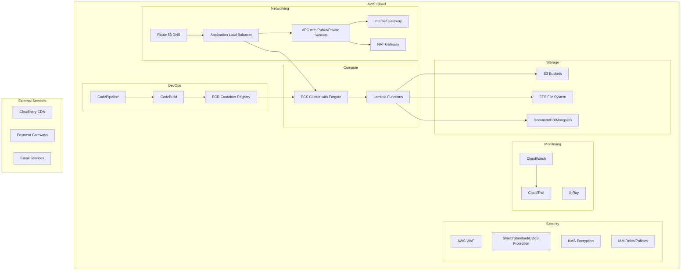

# AWS Deployment Summary for B2B E-Commerce Platform

This document provides a comprehensive summary of the AWS deployment architecture and configuration for the B2B E-Commerce Platform, integrating all components into a cohesive enterprise-grade solution.

## Deployment Architecture Overview

### High-Level Architecture
The B2B E-Commerce Platform is architected as a microservices-based solution deployed on AWS using ECS with Fargate for serverless container orchestration. The architecture emphasizes scalability, resilience, security, and operational excellence.

## Component Summary

### 1. Containerization Strategy
- **Docker Implementation**: Multi-stage Dockerfiles for all services
- **Optimization**: Alpine-based images with non-root user execution
- **Health Checks**: Built-in health check endpoints for all services
- **Security**: Image scanning and signing for container security

### 2. Microservices Architecture
- **Service Decomposition**: 9 independent microservices
- **Communication**: RESTful APIs with circuit breaker pattern
- **Data Management**: MongoDB with proper indexing and connection pooling
- **Scalability**: Independent scaling per service requirements

### 3. Database Deployment
- **Technology**: MongoDB (self-managed or DocumentDB)
- **Backup Strategy**: Automated daily snapshots with point-in-time recovery
- **Performance**: Proper indexing, connection pooling, and caching
- **Security**: Encryption at rest and in transit with IAM authentication

### 4. Load Balancing and Auto Scaling
- **Load Balancer**: Application Load Balancer with path-based routing
- **Auto Scaling**: ECS service auto scaling based on CPU/memory metrics
- **Health Checks**: Comprehensive health check implementation
- **Fault Tolerance**: Multi-AZ deployment for high availability

### 5. CI/CD Pipeline
- **Source Control**: GitHub integration with webhook triggers
- **Build Process**: AWS CodeBuild with custom build specifications
- **Deployment**: Blue-green deployments with ECS and CodeDeploy
- **Testing**: Automated unit, integration, and security testing

### 6. Monitoring and Logging
- **Metrics**: CloudWatch for infrastructure and custom application metrics
- **Tracing**: AWS X-Ray for distributed tracing
- **Logging**: Structured logging with centralized CloudWatch Logs
- **Alerting**: SNS notifications with escalation procedures

### 7. Security and Compliance
- **Identity Management**: IAM roles with least privilege principle
- **Network Security**: VPC segmentation with security groups and NACLs
- **Application Security**: WAF rules, secure coding practices, and dependency scanning
- **Data Protection**: Encryption with KMS and proper data classification
- **Compliance**: GDPR, PCI DSS, and SOC 2 alignment

## Deployment Process

### Phase 1: Infrastructure Setup
1. **VPC Configuration**: Create VPC with public/private subnets
2. **Security Groups**: Configure security groups for each service
3. **IAM Roles**: Set up IAM roles and policies
4. **Database**: Deploy MongoDB/DocumentDB with backup policies

### Phase 2: Container Registry Setup
1. **ECR Repositories**: Create repositories for each service
2. **Image Building**: Build and push Docker images
3. **Security Scanning**: Scan images for vulnerabilities

### Phase 3: ECS Cluster Deployment
1. **Cluster Creation**: Create ECS cluster with Fargate capacity
2. **Task Definitions**: Register task definitions for each service
3. **Services**: Deploy ECS services with proper configurations

### Phase 4: Networking and Security
1. **Load Balancer**: Configure ALB with routing rules
2. **WAF**: Set up WAF rules for application protection
3. **Certificates**: Configure SSL certificates with ACM

### Phase 5: CI/CD Pipeline
1. **CodePipeline**: Create pipeline with source, build, and deploy stages
2. **CodeBuild**: Configure build projects for each service
3. **Testing**: Implement automated testing in pipeline

### Phase 6: Monitoring and Logging
1. **CloudWatch**: Set up metrics and dashboards
2. **X-Ray**: Enable distributed tracing
3. **Alerts**: Configure CloudWatch alarms with SNS notifications

## Operational Excellence

### Day 2 Operations
- **Automated Patching**: Regular security updates for underlying infrastructure
- **Backup Verification**: Weekly restore testing of database backups
- **Performance Tuning**: Continuous optimization based on metrics
- **Cost Management**: Regular review of resource utilization and costs

### Incident Management
- **Runbooks**: Detailed procedures for common operational tasks
- **Escalation**: Clear escalation paths for different severity levels
- **Post-Incident Reviews**: Regular analysis of incidents and improvements
- **Chaos Engineering**: Periodic resilience testing

## Cost Optimization

### Resource Optimization
- **Right-Sizing**: Regular review of instance types and resource allocation
- **Spot Instances**: Use for fault-tolerant batch processing workloads
- **Reserved Instances**: Commit to predictable workloads for savings
- **Auto Scaling**: Dynamic resource allocation based on demand

### Storage Optimization
- **Lifecycle Policies**: Automated transition to cheaper storage tiers
- **Intelligent-Tiering**: S3 Intelligent-Tiering for unpredictable access patterns
- **Compression**: Data compression for storage efficiency
- **Deduplication**: Eliminate duplicate data

## Security Posture

### Continuous Security
- **Vulnerability Scanning**: Automated scanning of dependencies and containers
- **Penetration Testing**: Regular third-party security assessments
- **Compliance Monitoring**: Continuous compliance checking with AWS Config
- **Threat Detection**: Amazon GuardDuty for threat detection

### Data Protection
- **Encryption**: Encryption at rest and in transit for all data
- **Access Control**: Fine-grained access controls with IAM
- **Audit Trails**: Comprehensive logging of all data access
- **Data Loss Prevention**: Automated detection of sensitive data exposure

## Monitoring and Observability

### Comprehensive Observability
- **Metrics**: Real-time metrics for all system components
- **Logs**: Centralized log aggregation and analysis
- **Traces**: End-to-end request tracing
- **Business Metrics**: Key business indicators and KPIs

### Proactive Monitoring
- **Anomaly Detection**: Machine learning-based anomaly detection
- **Predictive Scaling**: Predictive auto scaling based on historical patterns
- **Performance Baselines**: Established performance baselines for alerting
- **User Experience Monitoring**: Real user monitoring for frontend performance

## Conclusion

This AWS deployment architecture provides a robust, scalable, and secure foundation for the B2B E-Commerce Platform. By leveraging AWS native services and following cloud best practices, the platform achieves:

- **High Availability**: Multi-AZ deployment with automatic failover
- **Elastic Scalability**: Auto scaling based on demand
- **Security**: Comprehensive security controls and compliance alignment
- **Operational Excellence**: Automated operations with comprehensive monitoring
- **Cost Optimization**: Efficient resource utilization and cost management

The modular architecture allows for independent evolution of services while maintaining system cohesion, enabling rapid innovation and feature delivery while ensuring enterprise-grade reliability and security.