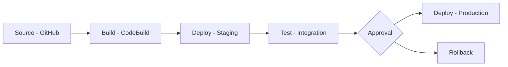

# CI/CD Pipeline for AWS Deployment

This document describes the CI/CD pipeline configuration for the B2B E-Commerce Platform, enabling automated testing, building, and deployment to AWS.

## Pipeline Architecture Overview

### AWS CodePipeline Structure
The CI/CD pipeline uses AWS CodePipeline with the following stages:
1. **Source**: Code repository integration
2. **Build**: Docker image building and testing
3. **Deploy**: ECS service deployment
4. **Test**: Post-deployment validation
5. **Approval**: Manual approval for production (if needed)

### Pipeline Visualization


## Source Stage Configuration

### GitHub Integration
- **Repository**: GitHub repository with webhook triggers
- **Branches**: 
  - `main` for production deployments
  - `develop` for staging deployments
  - Feature branches for pull request builds
- **Webhook**: Automatic trigger on push events
- **Polling**: Fallback every 5 minutes

### Source Artifacts
- **Format**: ZIP archive of source code
- **Versioning**: Git commit SHA as version identifier
- **Metadata**: Branch name, commit message, author information

## Build Stage Configuration

### AWS CodeBuild Projects

#### 1. API Gateway Build
```json
{
  "ProjectName": "b2b-api-gateway-build",
  "Source": {
    "Type": "CODEPIPELINE",
    "BuildSpec": "buildspec-api-gateway.yml"
  },
  "Environment": {
    "Type": "LINUX_CONTAINER",
    "Image": "aws/codebuild/standard:5.0",
    "ComputeType": "BUILD_GENERAL1_SMALL",
    "EnvironmentVariables": [
      {
        "Name": "SERVICE_NAME",
        "Value": "api-gateway"
      }
    ]
  },
  "Artifacts": {
    "Type": "CODEPIPELINE"
  }
}
```

#### 2. User Service Build
```json
{
  "ProjectName": "b2b-user-service-build",
  "Source": {
    "Type": "CODEPIPELINE",
    "BuildSpec": "buildspec-user-service.yml"
  },
  "Environment": {
    "Type": "LINUX_CONTAINER",
    "Image": "aws/codebuild/standard:5.0",
    "ComputeType": "BUILD_GENERAL1_SMALL"
  },
  "Artifacts": {
    "Type": "CODEPIPELINE"
  }
}
```

#### 3. Frontend Builds
- **Admin Dashboard Build**
- **Customer Portal Build**

### Build Specifications

#### buildspec-api-gateway.yml
```yaml
version: 0.2

phases:
  install:
    runtime-versions:
      nodejs: 18
    commands:
      - echo Installing dependencies...
      - npm install -g npm@latest
  
  pre_build:
    commands:
      - echo Logging in to Amazon ECR...
      - aws ecr get-login-password --region $AWS_DEFAULT_REGION | docker login --username AWS --password-stdin $AWS_ACCOUNT_ID.dkr.ecr.$AWS_DEFAULT_REGION.amazonaws.com
  
  build:
    commands:
      - echo Build started on `date`
      - echo Building the Docker image...
      - cd services/api-gateway
      - docker build -t $IMAGE_REPO_NAME:$IMAGE_TAG .
      - docker tag $IMAGE_REPO_NAME:$IMAGE_TAG $AWS_ACCOUNT_ID.dkr.ecr.$AWS_DEFAULT_REGION.amazonaws.com/$IMAGE_REPO_NAME:$IMAGE_TAG
  
  post_build:
    commands:
      - echo Build completed on `date`
      - echo Pushing the Docker image...
      - docker push $AWS_ACCOUNT_ID.dkr.ecr.$AWS_DEFAULT_REGION.amazonaws.com/$IMAGE_REPO_NAME:$IMAGE_TAG
      - printf '[{"name":"api-gateway","imageUri":"%s"}]' $AWS_ACCOUNT_ID.dkr.ecr.$AWS_DEFAULT_REGION.amazonaws.com/$IMAGE_REPO_NAME:$IMAGE_TAG > imagedefinitions.json

artifacts:
  files: 
    - imagedefinitions.json
    - services/api-gateway/Dockerrun.aws.json
```

#### buildspec-frontend.yml
```yaml
version: 0.2

phases:
  install:
    runtime-versions:
      nodejs: 18
    commands:
      - echo Installing dependencies...
      - npm install -g npm@latest
  
  pre_build:
    commands:
      - echo Installing frontend dependencies...
      - cd frontend/admin-dashboard
      - npm ci
  
  build:
    commands:
      - echo Build started on `date`
      - echo Building the frontend application...
      - npm run build
  
  post_build:
    commands:
      - echo Running tests...
      - npm test -- --watchAll=false

artifacts:
  files:
    - '**/*'
  base-directory: 'frontend/admin-dashboard/.next'
```

## Testing Strategy

### Unit Testing
- **Framework**: Jest for JavaScript/Node.js services
- **Coverage**: Minimum 80% code coverage required
- **Execution**: During build phase in CodeBuild
- **Reporting**: JUnit XML format for CodeBuild integration

### Integration Testing
- **Environment**: Dedicated test ECS cluster
- **Scope**: End-to-end service interactions
- **Data**: Test data fixtures and cleanup scripts
- **Execution**: Post-deployment in staging environment

### Security Testing
- **Static Analysis**: SonarQube or similar tools
- **Dependency Scanning**: npm audit for vulnerabilities
- **Container Scanning**: AWS ECR image scanning
- **Penetration Testing**: OWASP ZAP for API security

### Performance Testing
- **Load Testing**: Apache JMeter or Gatling
- **Scenarios**: Simulated user loads and transactions
- **Metrics**: Response times, throughput, error rates
- **Thresholds**: Defined SLA requirements

## Deployment Stage Configuration

### ECS Deployment Actions

#### Staging Deployment
```json
{
  "Name": "DeployStaging",
  "ActionTypeId": {
    "Category": "Deploy",
    "Owner": "AWS",
    "Provider": "ECS",
    "Version": "1"
  },
  "RunOrder": 1,
  "Configuration": {
    "ClusterName": "b2b-staging-cluster",
    "ServiceName": "b2b-staging-service",
    "FileName": "imagedefinitions.json"
  },
  "InputArtifacts": [
    {
      "Name": "BuildOutput"
    }
  ]
}
```

#### Production Deployment
```json
{
  "Name": "DeployProduction",
  "ActionTypeId": {
    "Category": "Deploy",
    "Owner": "AWS",
    "Provider": "ECS",
    "Version": "1"
  },
  "RunOrder": 2,
  "Configuration": {
    "ClusterName": "b2b-production-cluster",
    "ServiceName": "b2b-production-service",
    "FileName": "imagedefinitions.json"
  },
  "InputArtifacts": [
    {
      "Name": "BuildOutput"
    }
  ],
  "RoleArn": "arn:aws:iam::ACCOUNT_ID:role/CodePipelineServiceRole"
}
```

### Blue-Green Deployment Strategy
- **Mechanism**: ECS blue/green deployment with CodeDeploy
- **Traffic Shifting**: Gradual traffic shift over 15 minutes
- **Validation**: Pre-traffic and post-traffic hooks
- **Rollback**: Automatic rollback on hook failure

### Canary Deployment Strategy
- **Percentage**: Start with 10% traffic to new version
- **Duration**: Monitor for 10 minutes
- **Increase**: Gradually increase to 100%
- **Rollback**: Automatic on metric threshold breaches

## Pipeline Configuration Files

### codepipeline.json
```json
{
  "pipeline": {
    "name": "b2b-ecommerce-pipeline",
    "roleArn": "arn:aws:iam::ACCOUNT_ID:role/AWSCodePipelineServiceRole",
    "artifactStore": {
      "type": "S3",
      "location": "codepipeline-b2b-ecommerce-artifacts"
    },
    "stages": [
      {
        "name": "Source",
        "actions": [
          {
            "name": "SourceAction",
            "actionTypeId": {
              "category": "Source",
              "owner": "ThirdParty",
              "provider": "GitHub",
              "version": "1"
            },
            "outputArtifacts": [
              {
                "name": "SourceArtifact"
              }
            ],
            "configuration": {
              "Owner": "your-github-username",
              "Repo": "b2b-ecommerce-platform",
              "Branch": "main",
              "OAuthToken": "#{GitHubToken}"
            },
            "runOrder": 1
          }
        ]
      },
      {
        "name": "Build",
        "actions": [
          {
            "name": "BuildAPIGateway",
            "actionTypeId": {
              "category": "Build",
              "owner": "AWS",
              "provider": "CodeBuild",
              "version": "1"
            },
            "inputArtifacts": [
              {
                "name": "SourceArtifact"
              }
            ],
            "outputArtifacts": [
              {
                "name": "BuildArtifactAPIGateway"
              }
            ],
            "configuration": {
              "ProjectName": "b2b-api-gateway-build"
            },
            "runOrder": 1
          },
          {
            "name": "BuildUserService",
            "actionTypeId": {
              "category": "Build",
              "owner": "AWS",
              "provider": "CodeBuild",
              "version": "1"
            },
            "inputArtifacts": [
              {
                "name": "SourceArtifact"
              }
            ],
            "outputArtifacts": [
              {
                "name": "BuildArtifactUserService"
              }
            ],
            "configuration": {
              "ProjectName": "b2b-user-service-build"
            },
            "runOrder": 1
          }
        ]
      },
      {
        "name": "DeployStaging",
        "actions": [
          {
            "name": "DeployToStaging",
            "actionTypeId": {
              "category": "Deploy",
              "owner": "AWS",
              "provider": "ECS",
              "version": "1"
            },
            "inputArtifacts": [
              {
                "name": "BuildArtifactAPIGateway"
              }
            ],
            "configuration": {
              "ClusterName": "b2b-staging-cluster",
              "ServiceName": "b2b-staging-service",
              "FileName": "imagedefinitions.json"
            },
            "runOrder": 1
          }
        ]
      },
      {
        "name": "Test",
        "actions": [
          {
            "name": "IntegrationTests",
            "actionTypeId": {
              "category": "Test",
              "owner": "AWS",
              "provider": "CodeBuild",
              "version": "1"
            },
            "inputArtifacts": [
              {
                "name": "BuildArtifactAPIGateway"
              }
            ],
            "configuration": {
              "ProjectName": "b2b-integration-tests"
            },
            "runOrder": 1
          }
        ]
      },
      {
        "name": "Approve",
        "actions": [
          {
            "name": "ManualApproval",
            "actionTypeId": {
              "category": "Approval",
              "owner": "AWS",
              "provider": "Manual",
              "version": "1"
            },
            "configuration": {
              "CustomData": "Review staging deployment before promoting to production"
            },
            "runOrder": 1
          }
        ]
      },
      {
        "name": "DeployProduction",
        "actions": [
          {
            "name": "DeployToProduction",
            "actionTypeId": {
              "category": "Deploy",
              "owner": "AWS",
              "provider": "ECS",
              "version": "1"
            },
            "inputArtifacts": [
              {
                "name": "BuildArtifactAPIGateway"
              }
            ],
            "configuration": {
              "ClusterName": "b2b-production-cluster",
              "ServiceName": "b2b-production-service",
              "FileName": "imagedefinitions.json"
            },
            "runOrder": 1
          }
        ]
      }
    ]
  }
}
```

## Environment Promotion Strategy

### Multi-Environment Pipeline
1. **Development**: Feature branch deployments
2. **Staging**: Develop branch with production-like data
3. **Production**: Main branch with live traffic

### Environment-Specific Configurations
- **Parameter Store**: AWS Systems Manager Parameter Store for environment variables
- **Secrets Management**: AWS Secrets Manager for sensitive data
- **Feature Flags**: LaunchDarkly or custom solution for feature toggles

### Data Management
- **Development**: Synthetic test data
- **Staging**: Anonymized production data subset
- **Production**: Live customer data with backups

## Monitoring and Feedback Loops

### Build Metrics
- **Duration**: Track build times for optimization
- **Success Rate**: Monitor build success/failure rates
- **Resource Usage**: CPU and memory consumption during builds

### Deployment Metrics
- **Deployment Frequency**: How often deployments occur
- **Lead Time**: Time from code commit to production
- **Mean Time to Recovery**: Time to restore service after failure
- **Change Failure Rate**: Percentage of deployments causing failure

### Quality Gates
- **Code Coverage**: Minimum threshold for passing builds
- **Security Scans**: Vulnerability thresholds
- **Performance Tests**: Response time and throughput requirements
- **Integration Tests**: All tests must pass for promotion

## Pipeline Security

### Credential Management
- **IAM Roles**: Least privilege principle for pipeline components
- **Temporary Credentials**: STS tokens for build processes
- **Secret Rotation**: Automated rotation of sensitive credentials
- **Audit Trail**: CloudTrail logging of all pipeline activities

### Artifact Security
- **Encryption**: SSE-KMS for S3 artifacts
- **Integrity**: Checksum validation for artifacts
- **Access Control**: Bucket policies restricting access
- **Retention**: Automated cleanup of old artifacts

### Compliance Controls
- **Approval Gates**: Manual approvals for production deployments
- **Change Management**: Integration with change management systems
- **Audit Logging**: Comprehensive logging of all pipeline activities
- **Regulatory Compliance**: Adherence to industry standards (SOC, PCI, etc.)

## Pipeline Optimization

### Parallel Processing
- **Build Parallelization**: Concurrent builds for independent services
- **Test Parallelization**: Parallel execution of test suites
- **Deployment Parallelization**: Independent service deployments

### Caching Strategies
- **Dependency Caching**: Cache npm modules and other dependencies
- **Docker Layer Caching**: Reuse unchanged Docker layers
- **Build Output Caching**: Cache compiled assets when possible

### Resource Management
- **Dynamic Scaling**: Scale CodeBuild resources based on queue depth
- **Cost Optimization**: Use appropriate instance types for workloads
- **Spot Instances**: Leverage spot instances for fault-tolerant builds

This CI/CD pipeline configuration provides a robust, automated deployment process for the B2B E-Commerce Platform on AWS, ensuring rapid, reliable, and secure software delivery.